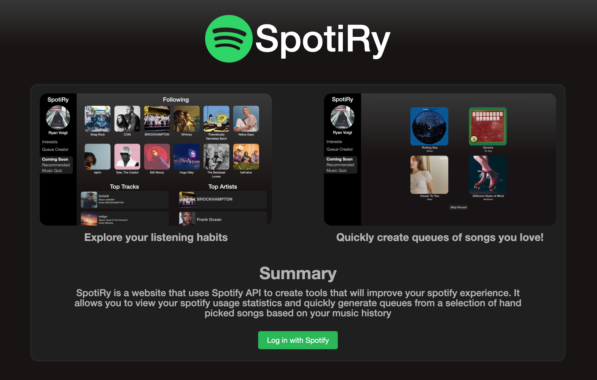

# Spotiry
Spotify Wrapped is an intersting think to see, your yearly statistics for your listening habits, but have you ever wondered what your ALL TIME listening statistics are? Find what artist spoke to you the most since you've started using spotify, what song was your absolute favourite, not just your favourite this year. Spotiry also has a build in queue creator, it hand picks a selection of recommended songs based on your listening habits and allows you to generate a queue very quickly with songs that have stuck with you over the years.

# Queue Creator

# Statistics

# Login

## Contributing
Pull requests are welcome. For major changes, please open an issue first to discuss what you would like to change.

Please make sure to update tests as appropriate.

## Roadmap
Eventually this software will reccomend songs you've never heard before and also include a music quiz to test your knowledge on lyrics and some of your favourite artists.
